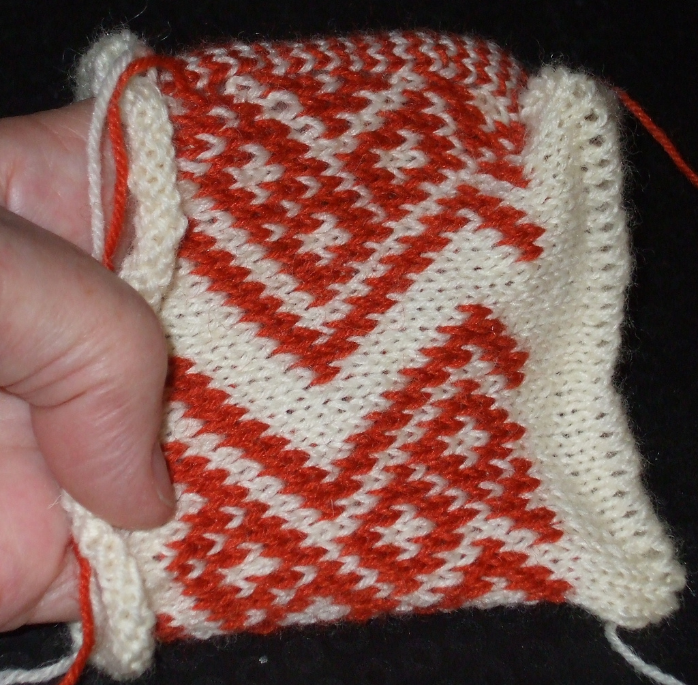
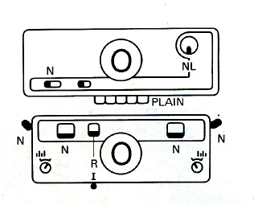
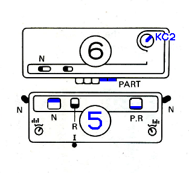
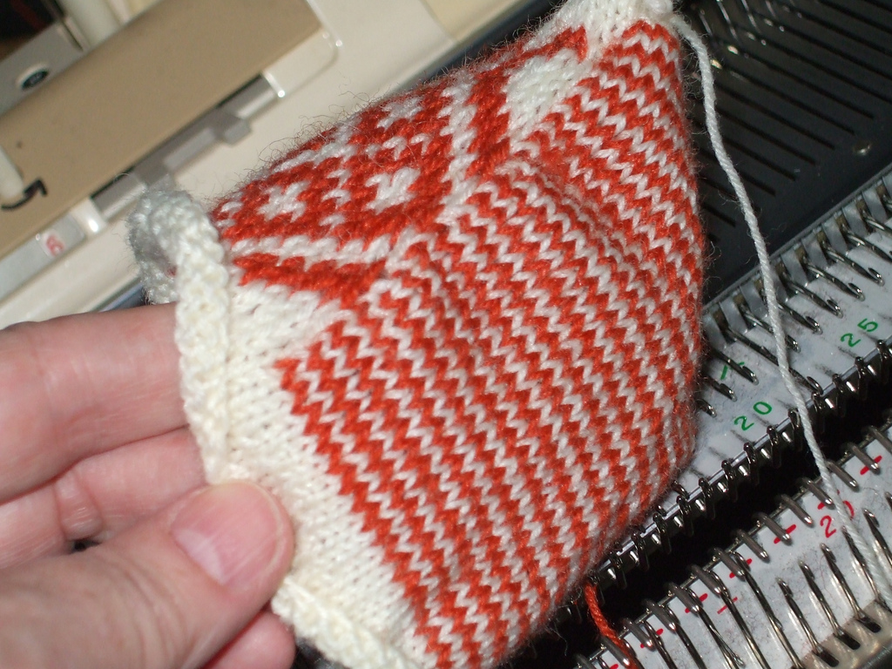
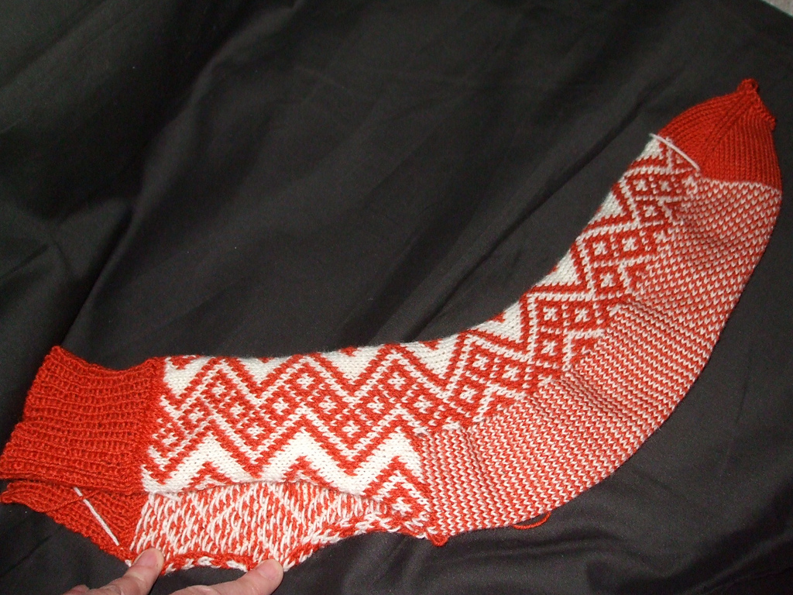

> A full tutorial for circular. Comments and corrections welcome.  
> And thanks to Cindy for suggesting this feature in the first place.  
> I’m using AYAB v0.9, this was also available in 0.8.  
> (First draft Sept 26, 2017, minor edits Nov 9, 2017)

* * *

The Circular technique is knitted in a very similar way to 2-color DBJ
(Double Bed Jacquard, AYAB’s “Ribber” setting,) but Circular makes a 2-color
stockinette tube. The Circular feature is the closest we can come to circular
fair-isle on a Brother machine.  
It helps to already be familiar with the standard ribber cast-on and with
2-color DBJ before attempting Circular.

This tutorial is very detailed but most of it is the casting on and setting up;
the actual circular part consists of four passes of the carriage with two
changes of color.  
Steps 11 - 14 are the AYAB setup, and 15 - 20 are the actual knitting.

For our first time through we will make one-row stripes on the ribber, there
will be two rows on the ribber for every one completed row on the main bed. So
the ribber side ends up twice as long as the patterned side knitted on the main
bed, making a rather oddly shaped tube.

This sample is a 64 stitch circle, L16-R16 on each bed. Stitch Size of T6/5
(Main 6, Ribber 5) is about right as a sample for a possible sock in Sock-Ease
yarn from Lion Brand. Or try going a bit tighter on the ribber to get a more
balanced tube.  
Steps 2 - 6 are a standard circular cast-on, with a small
variation from the settings described in the manual

1. Choose a fair-isle pattern. It must have short floats, especially near the edges of the width you plan to use. And no rows that are entirely either color, which would be a whole-row float. My sample is StitchWorld #27, you can download and use this file.

    

2. Install your ribber and color changer. Set the connected carriages on the right.

3. Rack the ribber to its central position, (5) and set the P-H to H. All
  settings on both carriages to normal, see p30 of the KR850 manual.

    

4. Thread the white yarn on the left side of the mast, black on the right.
  Thread the black into button 1 of the CC, and anchor it underneath. No
  buttons selected on the color changer yet. Take the white yarn behind the
  black and over to the carriage to start the cast on from the right.

5. Select needles L16 - R16 on both beds, and cast on for circular. Follow
  page 30 in the 850 manual, EXCEPT, after the zigzag row set just the RIGHT
  Part button on the main bed, and on the ribber set the LEFT slider up to P.R.
  and the right one down on N. Middle slider down. Side levers up, bottom slider
  on I. Both lili buttons to normal. Set the Stitch Sizes, try 6 on the main
  bed and 5 on the ribber. (Use ravel cord for the initial zigzag if you want an
  open tube, or you can just snip the cast-on later.)

    

6. Knit the zigzag row, hang the cast-on comb and one or two ribber weights.
  Set P-H to P. Leave the rest of the settings the same as the cast on.

7. Knit a few rows of plain circular, about 12 passes (6 circular rounds) in
  white ending COL (Carriage on Left).

8. Press button 2 on the CC so it is open to catch the white yarn, and put the
  carriage all the way out on the left into the color changer. The carriage
  waits here while we do the pattern setup.
  
    

9. Main carriage: KC knob to KC2, both Part buttons in.

10. Ribber carriage: No changes. Check that the left slider is up (P.R, or Part)
    right slider down (N, knit)

11. Row counter = 000

12. In AYAB: open the image, which must be at least as wide as the main bed
    needles you are using. Set the start/stop needles to the width you are
    knitting on the main bed, 16 and 16 in our example (or one or two wider,
    just be sure the settings are not narrower than your actual needles);
    2 colors; start at row 1 (usually); Infinite Repeat; Circular; Center.

13. Click Configure, then Knit.

14. Press Color Changer button 1 to select black.

15. Move the carriage out of the color changer and over the left turn mark. Stop
    and wait for the triple beep. And check that only the black yarn was selected.

16. Knit across, left - right, wait for the beep.

17. Knit across, right - left and all the way into the color changer, the beep
    should happen as you do so.

18. Press CC button 2, for white.

19. Knit across, left - right, wait for the beep.

20. Knit across, right - left and into the color changer, the beep should happen
    as you do so.

21. Press CC button 1, for black.

Repeat steps 16 - 21 for the rest of the project.

For this sample do about 20 rows (80 passes.) See the note below about hanging
extra weights on the ribber’s knitting.

To finish the sample, cancel the main carriage settings from step 7. Set to
standard circular (KC button at NL, right part button pushed in on main
carriage, left slider up at P.R. on the ribber as before, no lili) and knit
about 12 passes (6 rounds) in just one color. Bind off if you like, or just cut
the yarn, hold onto the comb below and take the carriage across and back to let
the knitting drop off.

Notes:

- The left-right rows knit on the ribber and select on the main bed. The
  right-left rows knit on the main bed leaving all needles in B afterwards, and
  slip (nothing knits) on the ribber.

- Don’t try to knit too fast. On the right you need to wait for the beep, and on
  the left give it time to take up the slack yarn as you approach the knitting.
  Also gives you time to check that the new yarn is correctly in the feeder.

- Watch the row numbers in AYAB as you knit. Note that 4 passes make 1 row; the
  row counter will say 4 when AYAB has just switched up from 1 and is starting
  the sequence of four passes for row 2. (AYAB v0.8 numbered the rows
  differently.)

- As always with ribber work, stop with the carriage on the right after about 5
  full rows (20 passes) to check:

    - unhook the starting ends of the yarn
    - make sure the ribber weights and comb are not caught on anything underneath
    - feel along the knitting on both sides from underneath, you may be able to
      tell if a loop is caught around a gate peg.
    - hang the “sevens” wires and weights if the edge stitches are having trouble
      knitting off.
    - you generally don’t need the fine knit bar for circular knitting.
    - IMPORTANT: hang some claw weights on the ribber side of the knitting,
      nearest to you. Make sure they hook into just the ribber-side layer of the
      knitting. This is because the ribber side is growing faster and its stitches
      need extra weight to stay on the needles.

Then check again after several inches have been knit, by now you may be able to
put a mirror underneath and check that the pattern you want is appearing on the
work on the side away from you, and stripes on the side facing you.

Look at your sample. Note that the striped back is twice as long as the front.
Further instructions soon for a way to prevent that and make a balanced tube.

And I think I just found a use for the unbalanced tube, and developed a new way
to do socks! The heel and foot are seamless fair-isle-in-the-round. No short
rows. Here’s the first prototype, the only seam (up the back of the leg) isn’t
sewn yet. Full tutorial coming soon.

This article is copied from [ravelry](https://www.ravelry.com/discuss/ayab/3346844/#12).
Thanks, Adrienne!  
[Feel free to improve it!](https://github.com/AllYarnsAreBeautiful/ayab-manual)