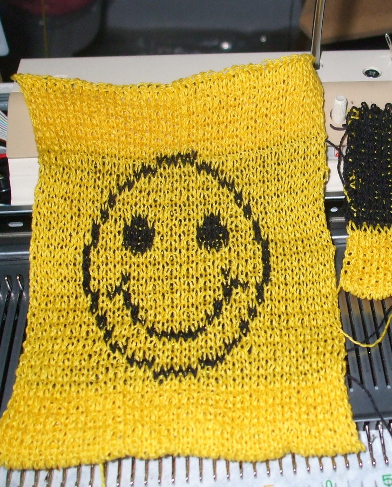
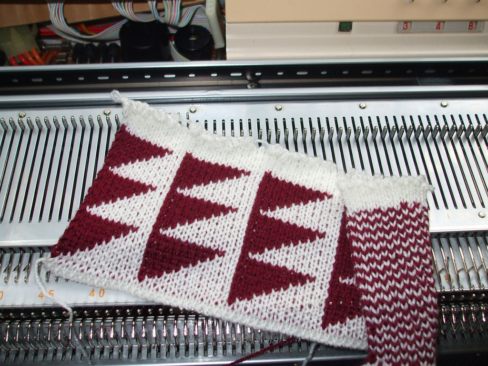
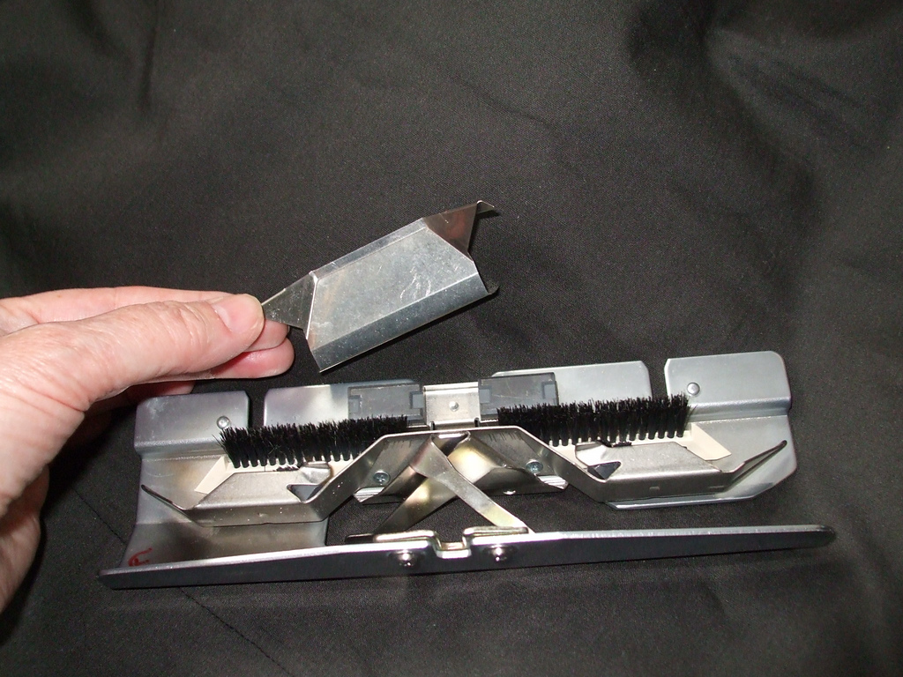

# Introduction

Instructions for 2-color Double Bed Jacquard
(AYAB’s “Ribber” setting.)

DBJ (more specifically: Rib Jacquard with birds-eye backing, see David J. 
Spencer, Knitting Technology: A Comprehensive Handbook and Practical Guide, 3rd 
ed., 2001, pp. 107ff.) is known in Brother manuals as Multi-Colour Rib. 
See page 38 of the [KR850 ribber manual](http://machineknittingetc.com/brother-kr850-ribber-user-guide.html) (the penguins) 
and page 11 of the [manual for the KRC-900 color changer](http://machineknittingetc.com/brother-krc900-double-bed-color-changer-user-guide.html).  
Note that DBJ in 3 or more colors has some differences, though the basic
instructions are the same.

Smiley was made from this image:

AYAB takes care of the colors for you, you just give it a black-and-white
pattern as if you are going to do single bed Fair Isle. To create your own patterns,
refer to the AYAB manual, section "pattern_image_creation". Make sure the 
width of the pattern has an even number of pixels (=stitches).  
Use thin yarns, you’ll be using side-by-side needles on both beds. (for those
in the US, Woollike yarn works well.)  
For your first practice sample, use this Triangles image that also comes with
AYAB 0.9, find it in Documents>AYAB>patterns.

which looks like this:

The useful thing about this Triangles pattern is that row 1 selects 1 black
needle per triangle, row 2 selects groups of 2, row 3 groups of 3 etc.
If you watch the needle selection carefully you’ll start to understand what
it’s doing.

# Instructions
- Set up the ribber (KR850 manual, pages 3-7)
- Set up the color changer (KHR900 manual, pages 2-4) with the black yarn 
  (foreground color); the white slot (background color) is open ready to accept 
  the yarn after the cast on.  
- You might need the fine knit bar. Try it if your stitches sometimes tuck
  instead of knitting off. 
- On the ribber, set half-pitch lever to H (P-H lever=H, see KR850 manual, 
  page 13), 
- On the ribber, set racking grip handle to 5 (Rack=5, KR850 manual p.13)
- set bracket lever to the normal (highest) position (KR850 manual, p.14)
- Needles L30-R30 on both beds for our first Triangles sample
- Make sure you have an even number of stitches on the ribber.
- Cast on in white in FNR (Full Needle Rib) as shown on pages 26-28 of the KR850 manual.
- Knit one or two rows of FNR.
- Carriage on left, outside the left turn mark.
- Set the row counter, RC=000
- Set up the carriages as shown on page 39 of the KR850 manual:  
    Page 39.png  
  Main bed: Both part buttons in; KC1 or KC2.  
  I usually use KC2 rather than KC1.  
  Ribber: Both sliders (cam levers) up. Both lili buttons to lili.  
  Lower slide lever to lili (center).  
  Stitch Size depends on your yarn. Try 4/4.

- Open a black/white image in AYAB. It must be at least as wide as the needles
  you are using. 
- Set AYAB to 2-color, start at row 1, Infinite Repeat, start/stop needles 30/30,
  Ribber ("Ribber: Classic" for AYAB v0.95), Center.
- Configure
- Knit
- Press the color changer button for the black yarn
- Bring the carriage out past the turn mark and stop to wait for the triple-beep
  as usual, just on this first row.
- Also check that the black yarn is in the feeder, and if this is its first row,
  check that the yarn end is hanging straight down and isn’t caught anywhere.
- Knit across, wait for the beep.
- Knit back and into the color changer, the beep happens as you do so.
- Press the button to change to white.
- Knit across, wait for the beep.
- Knit back and into the color changer, the beep happens as you do so.
- Press the button to change to black

That’s it, repeat: Knit across, knit back, change color.  
After the first set AYAB will have counted up two rows and be starting row 3,
the row counter will show 4 passes.

After about 10 rows (20 passes), stop with the carriage on the right and check:

- let the starting ends of the yarn hang free
- make sure the ribber weights and comb are not caught on anything underneath
- feel along the knitting on both sides from underneath, you may be able to tell
  if a loop is caught around a gate peg.
- hang the “sevens” wires and weights if the edge stitches are having trouble
  knitting off.

Then check again after several inches have been knit, by now you may be able to
put a mirror underneath and check that the pattern you want is appearing on the
work on the side away from you, and birds-eye stripes on the side facing you.

For finalizing the knit, you may want to add 1-2 rows of FNR (KR850 
manual, p. 28). Binding off (casting off) is described on page 53 of the KR850 manual. 
An alternative method ("Das Abketten II") is translated as follows: 
Transfer all stitches to the rear needle bed [to the needle bed  of the KH 910 
(KR850 manual, p.52)] and immediately set the empty needles of the KR 850 
ribber back to the B-position.
At the K carriage of the KH 910, set the tension dial 4 steps higher [to 7]. 
The tension dial of the KR 850 ribber carriage remains unchanged. Move the 
carriage from left to right. On the needles of the KR 850 ribber, stitches have 
formed around the previously empty needles. Disconnect the carriages 
[(KR850 manual, p. 15)] and move the KR 850 ribber carriage from right to left. 
Thereby, the stitches are removed from the needles of the KR 850 ribber. Now, 
lower the KR 850 ribber [to the lowest position (KR850 manual, p. 14)]. 
Set the needles of the KH 910 needle bed to the E-position. Remove the weights 
and the comb, then proceed by binding off as described on page 22 or 
pages 111-114 of the 
[KH910 manual](http://machineknittingetc.com/brother-kh910-user-guide.html).

# More description on how 2-color DBJ works

In our Triangles sample with Infinite Repeat on, let’s stop and observe, with
the carriage on the left at the beginning of row 1 of its cycle of ten rows. We
have just changed to the black yarn ready for the next row 1 as displayed in AYAB.  
Remember that AYAB’s row numbering focuses on what’s being _selected_ not what’s
being knitted.

Notice that what’s selected now is the last set of 10 black needles to complete
the previous triangle.  
Knit across from left-right.  
It has completed knitting the previous triangle, and has selected sets of 1
needle to do the first point of the next triangle.  
Knit across right-left and change color to white. Stop again and observe before
you knit the row.  
It has just knitted the single black stitches, and selected sets of 9 to be the
white stitches that go in between the single black ones for that same row.

The sequence of 4 passes for two rows is:  
Pass 1: Black yarn, knit whatever it was given by the last selection of the
previous set. Select for the black stitches for row 1 of this set of two rows.  
Pass 2: Black yarn, Knit the first black stitches, select for the white stitches
that will go in between the black stitches we just knitted, also for row 1 of
this set.  
Change color to white.  
Pass 3: White yarn, knit the selected needles to complete row 1, select for the
white stitches of row 2 of this set.  
Pass 4: White yarn, knit the selected needles, select for the black stitches of
row 2 of this set.  
Change color to black.

Notice that the selection is an “ABBA” sequence. Black, white, white, black;
repeat.

Each set of four passes does the selections for two rows of the pattern. But the
set is not completely self-contained, its first pass completes the knitting of
the previous set, and its fourth pass does a selection which will be knitted in
the first pass of the next set of four passes.

You’ll see discussions about Brother 2-color DBJ needing to start by selecting
from the right, so how does that square with AYAB always starting from the left?
I think it’s just an alternative way of thinking about how 2-color DBJ works.  
In the AYAB context where everything starts from the left, each set of 4 passes
has provided the selection for the next set during its last right-left pass. So
in a sense the first selection of the set did start on the right; in AYAB that
is counted as the last pass of the previous set.

# Further observations

- Color changers are not 100% reliable, though there are adjustments you can
  make. Occasionally it will grab both yarns or neither, and disaster ensues.
  Use the slower rhythm enforced by AYAB to take a look at the yarn in the
  feeder every time as it come out of the color changer. You may be able to stop
  in time to fix it.

- AYAB 0.9 and earlier expect the black yarn first. The more usual convention is
  to do the white first, more intuitive. That will likely be changed in a future
  release of AYAB; for now the instructions describe black first. Otherwise
  2-color DBJ works well as it is, doesn’t particularly need any code changes.

- You might be wondering what happens on the very first pass. There’s nothing
  pre-selected on the main bed, so it only knits on the ribber (alternating
  needles because of the lili settings) while selecting for the first black
  pattern stitches. Technically I think that means that there’s an extra ribber
  row at the beginning, but it gets absorbed into the backing pattern and is not
  noticeable. In subsequent first passes of the cycle of 4 passes/2 rows, it has
  been provided with selected needles to knit in black.

- How do you end your pattern on exactly the right row at the end of a repeat?
  In Infinite Repeat you’ll need to do one or two passes of the next cycle, but
  cancelling any selection on the second pass. In non-repeating, the long beep
  sounds after it has _selected_ for the last row. Knit one or two more passes.

- When using the lili settings, you must have an even number of stitches on the
  ribber. Take a look at the sides of your sample, do you want to have the edge
  stitch always on the main bed? (Optional, but may look better) To keep an even
  number on the ribber, your main bed will need on odd number of stitches.

- Doing some FNR after the cast-on and before starting the pattern can make a
  wavy edge. With careful management, it’s possible to use the last circular row
  of your cast-on as the first (setup) row of your pattern.

- Sometimes you want DBJ all in one color. Just make an image that’s all white
  or all black, no color-changing needed.

- Some of Brother’s DBJ instructions claim that the extra “latch plate” to add
  to the ribber connector arm is required. See page 49 of the 930/940 manual.
  Not so, it’s optional. In fact when I tried it it seemed to make things worse,
  the color change was less reliable. (Latch plate is misspelled as Clatch Plate
  in the 930/940 manual.)  

    

This article is copied from [ravelry](https://www.ravelry.com/discuss/ayab/3714047/1-25) 
and modified by [DerAndere](https://it-by-derandere.blogspot.com/p/blog-page_46.html).
Thanks, Adrienne!  
[Feel free to improve it!](https://github.com/AllYarnsAreBeautiful/ayab-manual)