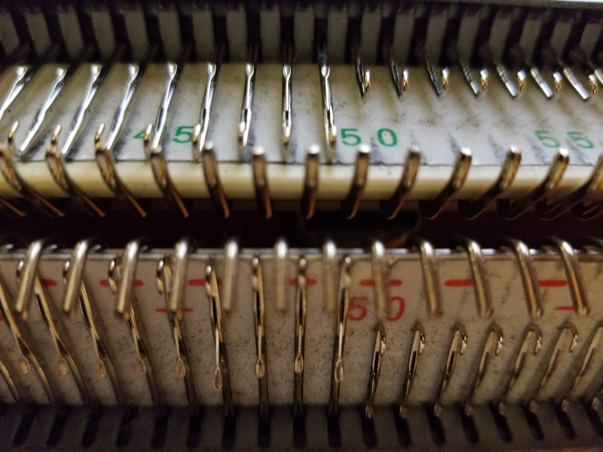
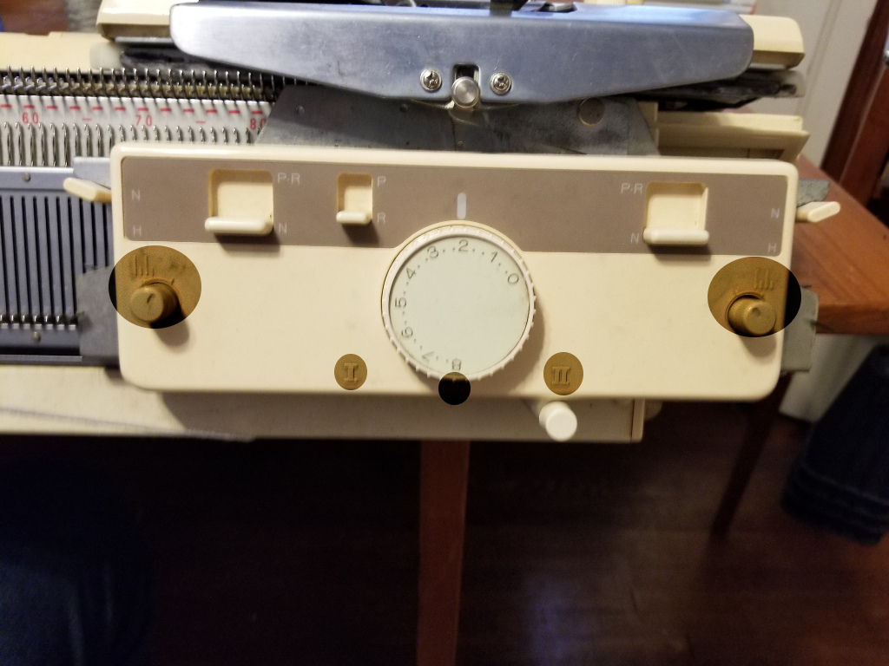

## Cast on ##

1. Thread your machine (including 4 color changer)
  * Thread everything except your white yarn through tension mast and color changer.

  * Use fine knitting bar if available
  
  
  * Set needles up for full needle rib
    * Every needle selected
    * Pitch lever set to half
    
    * Even number of needles on ribber
    * An extra needle on each side of ribber if available
    
2. Main carriage settings
  * Set knob to N-L
  * Set an appropriate tension (lower than tension setting for knitting)
  * No buttons depressed
  
3. Ribber carriage settings
  * II, no lili, N, N, R, N, N, no lili - read clockwise from roman numeral II near the bottom (pardon the bizzare highlighting, settings weren't visible in picture)
  * same tension as main carriage
  
4. While holding yarn under the machine pass carriage from right to left this will form a "zig-zag" row. If your last few stitches are tighter than the rest pull the needles back until they match the rest.

5. Hang cast on comb and plenty of weights

6. Remove wire from comb
7. Bring comb upwards between the beds and stick "pins" of comb up between the zig-zag

8. Reinsert wire and let comb drop to let the wire rest on the zig-zag

9. Hang weights - DBJ is usually more successful with a hefty amount of weight. Put the hooks of the weights through the holes on the bottom of the cast-on comb.
10. Drop extra stitches from ribber if you used them - they're only to help you get the edge stitches through the comb more neatly.
11. Set main carriage to part right and ribber to part left by depressing the part :arrow_forward: button on main carriage and moving the slider on the left side of the ribber carriage from N to P*R

12. Dial up tension 
13. Make 2 passes ending up with carriage on the left of the machine. This will make 1 round of circular knitting. Cast-on complete!

## Set carriages for pattern knitting ##
1. Make sure carriage is fully on the left of the machine even if size of knitting is smaller.
2. Main carriage settings
  * Knob to KC-I OR KC-II (I usually use KC-II)
  * Depress both part :arrow_backward: and part :arrow_forward: buttons

3. Ribber carriage settings
  * Both knobs to lili
  * Both sliders to P

4. initialize ayab (can do earlier, I prefer to wait until my cast on is complete)

## Begin Pattern Knitting ##
You'll be knitting colors from white pixels to black pixels and back.  
So the color order will be  
1 - 2 - 3 - 2  
or  
White - Gray - Black - Gray    
While your yarn colors may not match the pixels I'll refer to them as if they do.  
On your first pass bring the carriage up to the knitting slowly until the magnet on the back aligns with the sensor on the machine and you hear the double beep.

1. With the white yarn make 2 passes of the carriage
2. With the gray yarn make 2 passes of the carriage
3. With the black yarn make 2 passes of the carriage
4. With the gray yarn make 2 passes of the carriage
5. repeat steps 1-4 until piece is complete

## Bind-Off
There are many ways to bind off but this is a good standard method

[Double Bed Bind-Off Video](https://youtu.be/VEzJg0oRzVw)