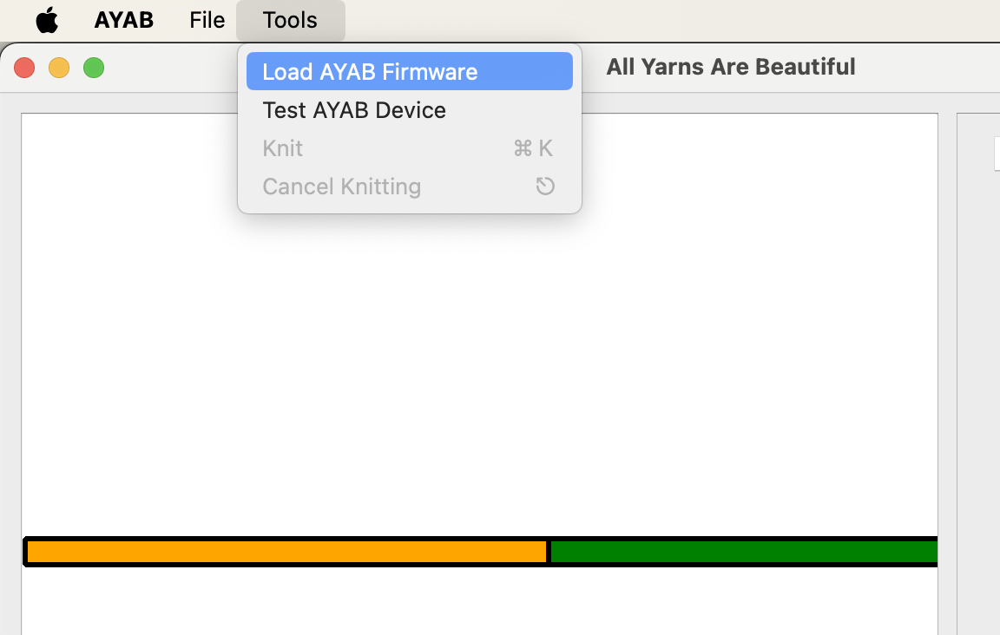
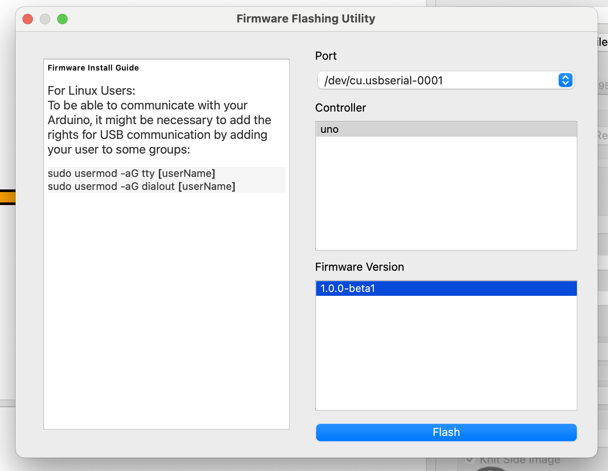
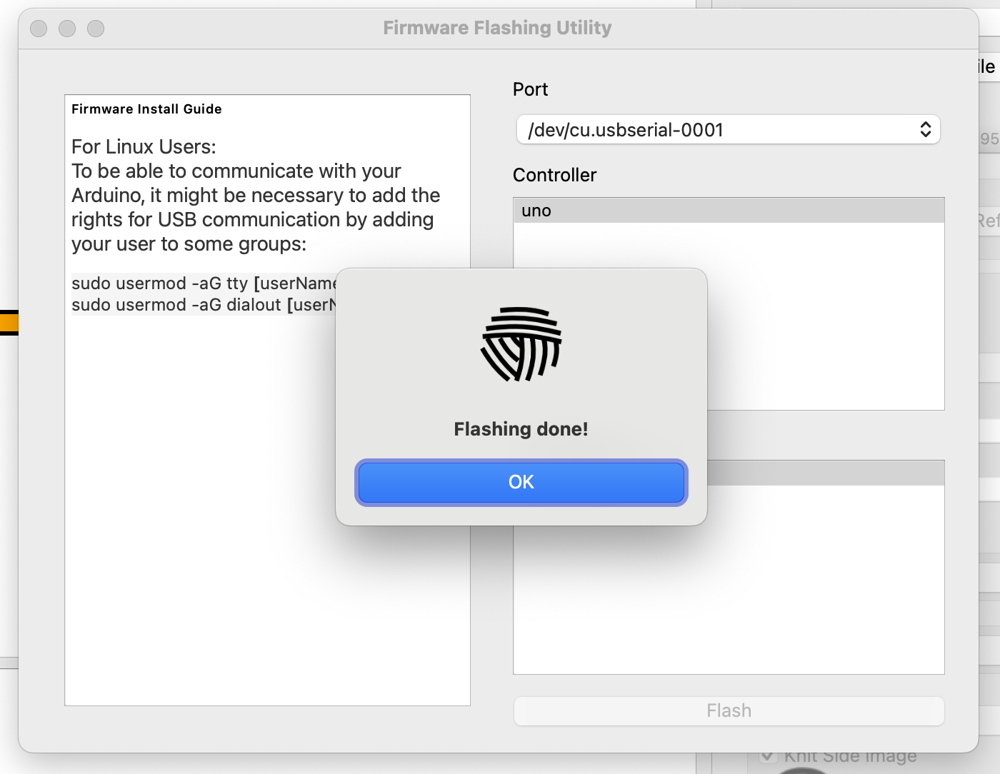

# Firmware

Part of the software that makes up AYAB runs on the Arduino board that is either plugged into your AYAB shield or part of your AYAB interface. We call this part the **firmware**. It is very small (about the size of a plain text email) but crucial to the operation of AYAB!

The AYAB desktop application you installed on your computer contains the necessary firmware ready to copy to the Arduino board, but you need to ask it to do that operation. We call this "uploading" or "flashing" the firmware.

You should perform this operation every time you install a new AYAB version on your computer. Or, if you have multiple versions of AYAB installed (for testing, for example), every time you switch from one version to another.

Starting with AYAB 1.0, the same firmware is used regardless of the knitting machine you install the shield or interface into. So, if you have multiple knitting machines and move your AYAB shield or interface between them, there is no need to upload the firmware again every time you switch between machines.

## Uploading the firmware

These steps assume you have already followed the [Software installation](./software.md) instructions.

Do not launch the AYAB application yet! First, plug your Arduino board or AYAB interface into your computer with the correct USB cable. At least one LED should light up on the board. If the computer prompts you to install drivers, follow its instructions.

Note that the shield or interface does not need to be connected to the knitting machine for this operation, but if it is, there is no need to separate it from the machine either.

Next, launch the AYAB software. Open to the **Tools** menu and choose the **Load AYAB firmware** item.

AYAB's _Firmware Flashing Utility_ opens.

Look at the **Port** drop-down in the top right of the window. If it is empty, it means your Arduino board was not detected. Make sure the board is correctly plugged in; to give it another chance, you will have to close the _Firmware Flashing Utility_ and re-open it so that it tries to detect the board again.

If multiple devices appear in the list and you're not sure which is your AYAB board, you can try unplugging non-essential USB devices from your computer, then close and re-open the _Firmware Flashing Utility_ so that the list is refreshed.

Once you have selected the correct **Port**, you can go on to select the **uno** controller (this is the only type of Arduino board that AYAB 1.0 supports), then the **Firmware Version** of which there will generally only be one — the one that works with the AYAB application you are running.

Once the firmware version is selected, the **Flash** button becomes available. Click it, and if everything goes to plan, after a few seconds the software should tell you the operation is complete:

Close the pop-up and the _Firmware Flashing Utility_. You're all set to knit!