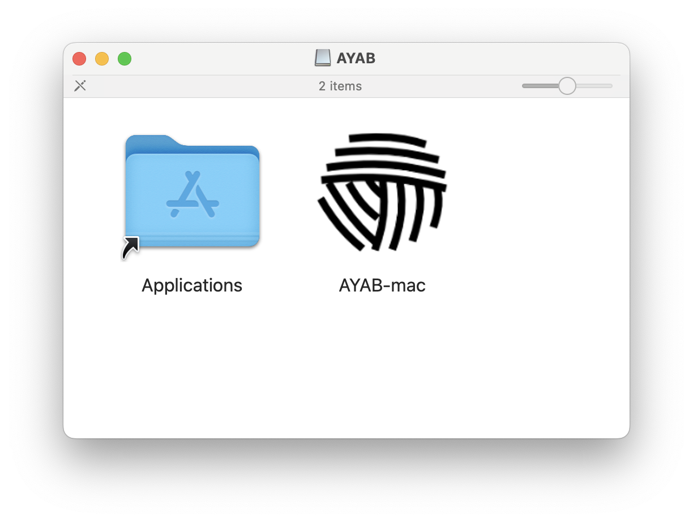

# Software

## Windows

### Prerequisites

AYAB requires Windows 10 or Windows 11.

### USB Serial port setup

Depending on your Windows version and the make of your Arduino board, you may need to install an USB Serial driver. Recent Windows versions should prompt you to install the necessary drivers automatically though, so it's best to first try plugging the board in and see if it is detected as a serial device in AYAB.

If you have trouble getting the board to be detected, installing the [Arduino IDE](https://www.arduino.cc/en/software) and following its instructions is recommended. Until the board is detected in the Arduino IDE it won't work with AYAB.

### Installation

Download the Windows setup from [Github Releases Page](https://github.com/AllYarnsAreBeautiful/ayab-desktop/releases/tag/1.0.0).

Run the setup, install AYAB and run it with the icon on your Desktop.

**Important**: when choosing the installation directory, make sure that you do not overwrite any previous versions. Remove them or use another folder for installation.

Once AYAB opens, make sure to open the preferences panel (**Preferences** > **Set Preferences**) and select your knitting machine model.

You can now head over to [Firmware](./firmware.md) to update your Arduino board.

## macOS

### Prerequisites

AYAB requires macOS 11 (Big Sur) or newer.

### USB Serial port setup

Depending on your macOS version and the make of your Arduino board, you may need to install an USB Serial driver. Recent macOS versions tend to have
all the necessary drivers pre-installed though, so it's best to first try plugging the board in and see if it is detected as a serial device in AYAB.

If you have trouble getting the board to be detected, installing the [Arduino IDE](https://www.arduino.cc/en/software) and following its instructions is recommended. Until the board is detected in the Arduino IDE it won't work with AYAB.

### Installation

Download the macOS `dmg` file from [Github Releases Page](https://github.com/AllYarnsAreBeautiful/ayab-desktop/releases/tag/1.0.0). 

When you double-click the downloaded `dmg` file, you get to see what's in the disk image:

Drag the AYAB icon to the `Applications` folder shortcut. You can now "eject" the disk image and put it in the trash.

Then run AYAB from your **Applications** folder.

Once AYAB opens, make sure to open the preferences panel (**AYAB** > **Settings…**) and select your knitting machine model.

You can now head over to [Firmware](./firmware.md) to update your Arduino board.

## Linux

### Prerequisites

AYAB is built with [Qt](https://www.qt.io). The official list of supported Linux distributions is published [on the Qt website](https://doc.qt.io/qt-6/linux.html#supported-configurations), but most recent distributions should have no problem running AYAB.

The AYAB [AppImage](https://appimage.org) includes most dependencies the application needs to run, such as Python and Qt.

If you have a desktop environment running you should be ready to run AYAB as you downloaded it. However, to flash the AYAB firmware to your shield or interface, you'll need to install `avrdude`, which you can generally install with your package manager:

*For Debian/Ubuntu*

    sudo apt install avrdude

*For openSUSE*

    sudo zypper install avrdude

*For Fedora*

    sudo yum install avrdude

#### Serial port access permissions

To be able to communicate with your Arduino, it might be necessary to add the rights for USB communication by adding your user to some groups.

    sudo usermod -a -G tty [userName]
    sudo usermod -a -G dialout [userName]

After doing that you may need to close and reopen your session.

### Installation

Download the Linux AppImage from [Github Releases Page](https://github.com/AllYarnsAreBeautiful/ayab-desktop/releases/tag/1.0.0). 

Follow the [AppImage instructions](https://docs.appimage.org/introduction/quickstart.html#how-to-run-an-appimage) to make the AppImage executable.

Then you can double-click the AppImage to start AYAB.

Once AYAB opens, make sure to open the preferences panel (**Preferences** > **Set Preferences**) and select your knitting machine model.

You can now head over to [Firmware](./firmware.md) to update your Arduino board.
